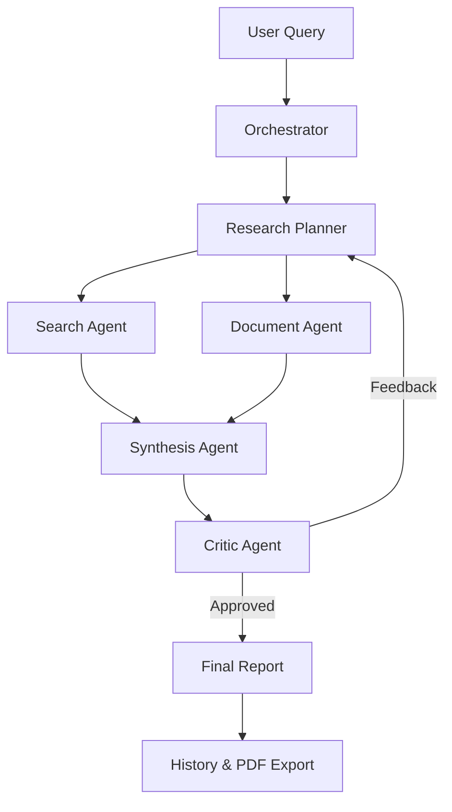
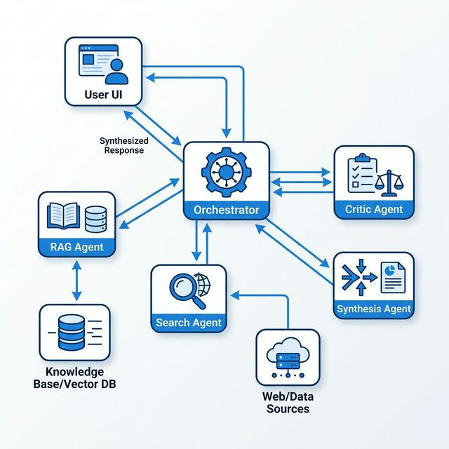
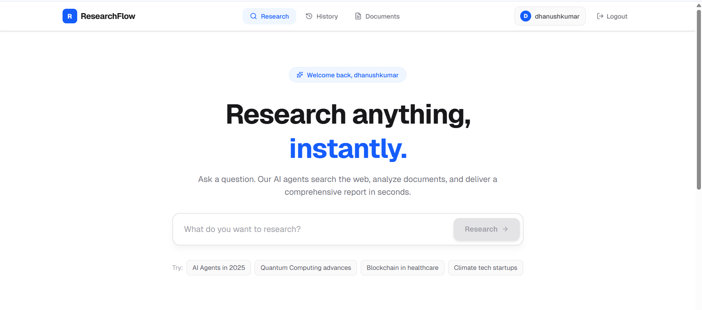
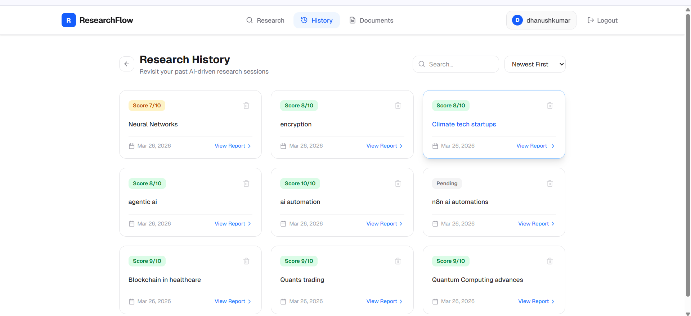

# 🚀 ResearchFlow: Multi-Agent Intelligence Engine

**Research anything, instantly.**  
ResearchFlow is a production-grade multi-agent research platform that orchestrates specialized AI agents to plan, search, retrieve document context, synthesize reports, and critique results in real-time.

[](https://research-flow-flame.vercel.app/)
[](https://opensource.org/licenses/MIT)

---

## 🛠 Tech Stack

| Category | Tools | Why? |
| :--- | :--- | :--- |
| **Orchestration** | LangGraph + LangChain | Robust state management for complex multi-agent flows. |
| **Frontend** | Next.js 14 + Tailwind CSS | Performance, SEO, and sleek modern UI components. |
| **Backend** | Node.js (Express) + TypeScript | High concurrency for SSE streaming and type safety. |
| **Search Engine** | Tavily AI | Optimized for high-quality LLM research data. |
| **Vector DB** | Qdrant | Fast, scalable semantic search for RAG. |
| **Database** | PostgreSQL | Reliability and relationship management for session history. |
| **Memory/Cache** | Upstash Redis | Global low-latency caching and rate limiting. |
| **Deployment** | Render (Backend) + Vercel (Frontend) | Seamless CI/CD and production scalability. |

---

## 🏗 System Architecture

ResearchFlow uses a **Stateful Graph** architecture to manage the lifecycle of a research task.





---

## ✨ Key Features

- **Multi-Agent Collaboration:** 5+ agents (Planner, Searcher, Researcher, Critic, Writer) working in parallel.
- **RAG Document Vault:** Upload PDFs for semantic retrieval mixed with real-time web search.
- **Real-Time Streaming:** Watch the agents "think" and "work" via Server-Sent Events (SSE).
- **Admin Dashboard:** Monitor latency, token usage, and system health.
- **Persistent History:** Automatically save every research session with scores and metadata.
- **Secure Auth:** JWT-based stateless authentication.

---

## 📸 Screenshots

| Home & Research Chat | Research History |
| :---: | :---: |
|  |  |

---

## 🚀 Setup Instructions

### Prerequisites
- Node.js 18+
- Docker & Docker Compose
- API Keys: Groq, Google Generative AI, Tavily, Upstash, Qdrant.

### Local Installation
1. **Clone the repo:**
   ```bash
   git clone https://github.com/dhanushkumar-amk/ResearchFlow.git
   cd ResearchFlow
   ```

2. **Backend Setup:**
   ```bash
   cd backend
   cp .env.example .env
   npm install
   npm run dev
   ```

3. **Frontend Setup:**
   ```bash
   cd ../frontend
   cp .env.example .env
   npm install
   npm run dev
   ```

---

## 🔑 Environment Variables

### Backend (`/backend/.env`)
- `PORT`: Server port (default 3001)
- `JWT_SECRET`: For authentication
- `GROQ_API_KEY`: Llama 3 provider
- `GOOGLE_API_KEY`: Gemini provider
- `TAVILY_API_KEY`: Web search provider
- `DATABASE_URL`: PostgreSQL connection string
- `UPSTASH_REDIS_REST_URL`: Caching layer
- `QDRANT_URL/API_KEY`: Vector store

### Frontend (`/frontend/.env`)
- `NEXT_PUBLIC_API_URL`: The Backend URL (Locally `http://localhost:3001`)

---

## 📡 API Endpoints

- `POST /api/auth/register` - New user signup
- `POST /api/research` - Start research task
- `GET /api/research/:id/stream` - SSE stream of updates
- `POST /api/documents/upload` - Upload PDF for RAG
- `GET /api/admin/logs` - Agent execution metrics

---

## ⚠️ Known Limitations
- **Free Tier Sleep:** The backend is hosted on Render's free tier, so the first request may take ~50s to wake up.
- **Token Limits:** Large document uploads might hit context window limits during intensive research.
- **Search Precision:** Highly niche or very recent (last 1 hour) topics may rely heavily on Tavily results.

---

Developed with ❤️ by Dhanushkumar.
