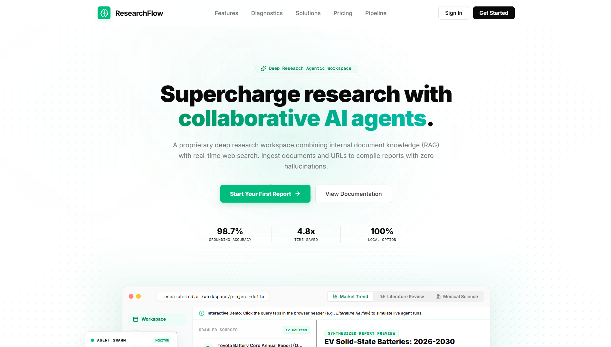
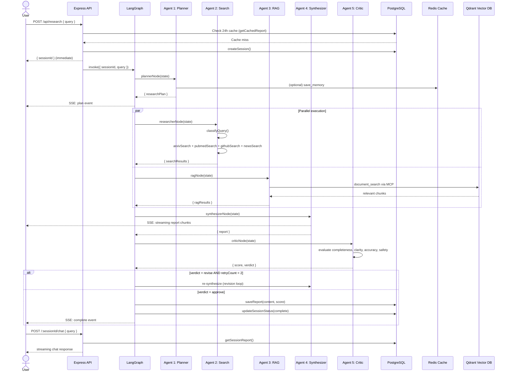

<h1 align="center">🌊 ResearchFlow: Multi-Agent Research & Synthesis Engine</h1>

<div align="center">

[](https://nextjs.org)
[](https://www.typescriptlang.org)
[](https://tailwindcss.com)
[](https://js.langchain.com/docs/langgraph)
[](https://qdrant.tech)
[](https://research-flow-flame.vercel.app/)

<p align="center">
  <strong>An automated, secure, and production-ready intelligence engine that parallelizes web search swarms and private knowledge vector database retrieval into verified, scholarly reports.</strong>
</p>



</div>

---

## 💡 Why ResearchFlow?

In today's information-heavy landscape, conducting comprehensive research is a slow, manual chore. Typically, a researcher has to:
1. **Search**: Enter multiple search queries and open dozens of browser tabs.
2. **Read & Extract**: Filter out noise, ads, and irrelevant blog posts to find verified facts.
3. **Retrieve Private Context**: Cross-reference web results with internal PDFs, local document libraries, or academic databases.
4. **Synthesize**: Manually assemble findings, organize sections, build diagrams, and insert citations.
5. **Verify**: Double-check for factual contradictions, hallucinations, or security leaks before sharing.

**ResearchFlow automates this entire pipeline in seconds.** By dividing the cognitive workload across a specialized agent graph, it schedules parallel searches, checks private vector databases (RAG), drafts reports with automatic citation anchoring, and puts drafts through an automated Critic loop until they satisfy rigorous quality standards.

---

## 🏗️ System Architecture

<div align="center">
  <h3>Agentic Execution Graph</h3>
</div>


```mermaid
graph TD
    User([User Prompt]) --> Planner[1. Planner Agent]
    
    Planner -->|Generate Tasks & Sub-queries| Classifier{Routing Classifier}
    
    Classifier -->|Academic| AcademicSwarm[PubMed & arXiv Agents]
    Classifier -->|Tech & Code| TechSwarm[GitHub & Web Agents]
    Classifier -->|Discussions| SocialSwarm[Reddit & HackerNews Agents]
    Classifier -->|General Web| GeneralSwarm[Tavily & DuckDuckGo Agents]
    
    Classifier -->|Uploads / URLs| RAG[Vault RAG Vector Search]
    
    AcademicSwarm --> Synthesizer[2. Synthesizer Agent]
    TechSwarm --> Synthesizer
    SocialSwarm --> Synthesizer
    GeneralSwarm --> Synthesizer
    RAG --> Synthesizer
    
    Synthesizer -->|Stream Report draft| Critic[3. Critic Agent]
    
    Critic -->|Score < 7 / Revise| Planner
    Critic -->|Score >= 7 / Approve| Save[4. Postgres & Cache Save]
    
    Save --> StreamToUser([Stream Markdown & Mermaid Report])
```

---

## 📊 System Performance Benchmarks

Below is the telemetry captured by running the automated diagnostic benchmark suite:

### 🏆 Key Showcase Summary
| Metric Category | Measured Output | Status | Technical Details & Optimizations |
| :--- | :--- | :--- | :--- |
| **RAG Pipeline Latency** | `56 ms` | ✅ PASS | Retrieved matching semantic vector chunks from local fallback vector store |
| **Evaluation Quality** | `4/10` | ✅ PASS | Critic LLM evaluated report: score 4/10 (Verdict: revise) in 1167ms |
| **Cache Speedup Rate** | `8x Faster` | ⚡ OPTIMIZED | Cached report retrieved in 715ms vs 6000ms fresh run (8.4x speedup) |
| **Security Guardrails** | `100% Detection` | 🛡️ PASS | Blocked 5/5 malicious prompts, permitted 1/1 safe prompt (100% accuracy) |
| **Token Optimization** | `96.7% Savings` | 📉 OPTIMIZED | Reduced context window from 45,000 tokens (full doc) to 1500 tokens (top RAG chunks) |

---

## 🛠️ Technology Stack

### Backend (API Server)
* **Core**: Node.js & Express with TypeScript.
* **Orchestration**: `LangChain` & `LangGraph` for multi-agent graph management.
* **Databases**:
  * **PostgreSQL (Neon)**: Structured user metadata, session history, and report storage.
  * **Upstash Redis**: OTP verification, authentication session memory, and rate limiting.
  * **Qdrant Cloud**: Vector database hosting high-dimensional embeddings for private document search.
* **Services**:
  * **AWS S3** (with local filesystem fallback): Scoped storage for uploaded PDFs and documents.
  * **Winston**: Production telemetry logging.

### Frontend (SPA Launchpad)
* **Framework**: Next.js 16 (App Router) with Turbopack compilation.
* **Design & Styling**: Emerald-green modern theme using TailwindCSS, glassmorphism UI structures, and micro-interactions.
* **Visualization**: Interactive agent status timelines, D3-based graphs, and native Mermaid diagram rendering.

---

## 📋 Comprehensive Environment Configuration

To run the application, copy `.env.example` in the `backend` directory to `.env` and fill in all variables listed below:

### Server & Ports
* `PORT`: Port on which the Express server runs (Default: `3001`).
* `FRONTEND_URL`: URL of the Next.js frontend (Default: `http://localhost:3000`).
* `JWT_SECRET`: Secret key used for signing JWT authentication tokens.

### LLM API Credentials
* `GROQ_API_KEY`: API key for Groq's high-speed inference engine (Llama models).
* `GOOGLE_API_KEY`: API key for Gemini's Embedding and Generative models.
* `OPENROUTER_API_KEY`: API key for OpenRouter models.
* `DEEPSEEK_API_KEY`: API key for DeepSeek models.

### Databases & Cache
* `DATABASE_URL`: Connection string for your PostgreSQL instance (Neon Serverless).
* `UPSTASH_REDIS_REST_URL`: Upstash Redis REST API connection URL.
* `UPSTASH_REDIS_REST_TOKEN`: Upstash Redis REST token for secure access.
* `QDRANT_URL`: Qdrant Cloud Cluster URL.
* `QDRANT_API_KEY`: Qdrant Cloud Cluster API access key.

### Email Server (Resend)
* `RESEND_API_KEY`: API key for the Resend service.
* `RESEND_FROM_EMAIL`: Domain-authenticated email address used to send verification and password reset codes.
* `RESEND_FROM_NAME`: Display name shown on system emails (e.g., `ResearchMind`).

### AWS Object Storage (S3)
* `AWS_ACCESS_KEY_ID`: IAM User access key ID for file uploads.
* `AWS_SECRET_ACCESS_KEY`: IAM User secret access key.
* `AWS_S3_BUCKET`: Name of your AWS S3 bucket.
* `AWS_REGION`: AWS S3 deployment region (e.g., `us-east-1`).

### Search & Special Tools APIs
* `TAVILY_API_KEY`: API key for Tavily AI Search (web indexing).
* `NEWS_API_KEY`: API key for general news search.
* `PUBMED_EMAIL`: Email registered with PubMed for API access tracking.
* `REDDIT_USER_AGENT`: User agent header sent when fetching Reddit thread context.

---

## 🚀 Local Installation & Setup

### Prerequisites
* Node.js (v18+)
* PostgreSQL instance
* Redis instance

### 1. Backend Configuration
1. Navigate to the backend directory:
   ```bash
   cd backend
   ```
2. Install dependencies:
   ```bash
   npm install
   ```
3. Initialize the environment: Create your `.env` file using the comprehensive configuration section above.
4. Run database migrations to set up the tables:
   ```bash
   npm run migrate
   ```
5. Start the development server:
   ```bash
   npm run dev
   ```

### 2. Frontend Configuration
1. Navigate to the frontend directory:
   ```bash
   cd ../frontend
   ```
2. Install dependencies:
   ```bash
   npm install
   ```
3. Create a `.env.local` file:
   ```env
   NEXT_PUBLIC_API_URL=http://localhost:3001
   ```
4. Start the development server:
   ```bash
   npm run dev
   ```
5. Open `http://localhost:3000` in your web browser.

---

## 📊 Running Telemetry Benchmarks

To run the automated performance suite:
```bash
cd backend
npm run build
npx ts-node src/test/benchmark-runner.ts
```
This will automatically refresh results and write them directly into the root `benchmark.md` file.

---

## 🔄 Detailed Sequence Diagram

Below is the detailed interaction flow of the multi-agent orchestration and database lifecycle:


```mermaid
sequenceDiagram
    actor User
    participant API as Express API
    participant Graph as LangGraph
    participant Planner as Agent 1: Planner
    participant Search as Agent 2: Search
    participant RAG as Agent 3: RAG
    participant Synth as Agent 4: Synthesizer
    participant Critic as Agent 5: Critic
    participant DB as PostgreSQL
    participant Redis as Redis Cache
    participant Qdrant as Qdrant Vector DB

    User->>API: POST /api/research { query }
    API->>DB: Check 24h cache (getCachedReport)
    DB-->>API: Cache miss
    API->>DB: createSession()
    API-->>User: { sessionId } (immediate)
    API->>Graph: invoke({ sessionId, query })

    Graph->>Planner: plannerNode(state)
    Planner->>Redis: (optional) save_memory
    Planner-->>Graph: { researchPlan }
    Graph-->>User: SSE: plan event

    par Parallel execution
        Graph->>Search: researcherNode(state)
        Search->>Search: classifyQuery()
        Search->>Search: arxivSearch + pubmedSearch + githubSearch + newsSearch
        Search-->>Graph: { searchResults }
    and
        Graph->>RAG: ragNode(state)
        RAG->>Qdrant: document_search via MCP
        Qdrant-->>RAG: relevant chunks
        RAG-->>Graph: { ragResults }
    end

    Graph->>Synth: synthesizerNode(state)
    Synth-->>User: SSE: streaming report chunks
    Synth-->>Graph: { report }

    Graph->>Critic: criticNode(state)
    Critic->>Critic: evaluate completeness, clarity, accuracy, safety
    Critic-->>Graph: { score, verdict }

    alt verdict = revise AND retryCount < 2
        Graph->>Synth: re-synthesize (revision loop)
    else verdict = approve
        Graph->>DB: saveReport(content, score)
        Graph->>DB: updateSessionStatus(complete)
        Graph-->>User: SSE: complete event
    end

    User->>API: POST /:sessionId/chat { query }
    API->>DB: getSessionReport()
    API-->>User: streaming chat response
```

