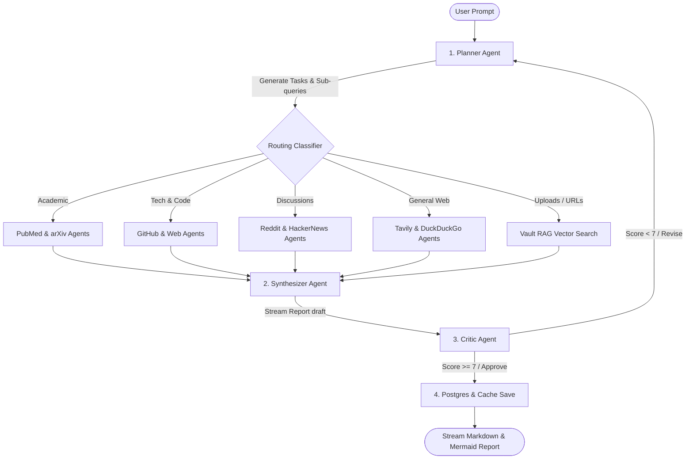

# 🌊 ResearchFlow: Multi-Agent Research & Synthesis Engine

ResearchFlow is a state-of-the-art, multi-agent AI research assistant designed to automate deep-dive information gathering, validation, and professional report synthesis. Built using **TypeScript**, **Next.js**, **LangGraph**, and **Qdrant Vector Database**, it orchestrates a swarm of specialized agents to gather web search results, retrieve private document context, and iteratively evaluate reports for safety and accuracy.

---

## 🏗️ System Architecture

ResearchFlow uses a directed multi-agent graph to handle queries. The diagram below illustrates how your request is broken down, researched, cross-referenced, and verified:


```mermaid
graph TD
    User([User Prompt]) --> Planner[1. Planner Agent]
    
    Planner -->|Generate Tasks & Sub-queries| Classifier{Routing Classifier}
    
    Classifier -->|Academic| AcademicSwarm[PubMed & arXiv Agents]
    Classifier -->|Tech & Code| TechSwarm[GitHub & Web Agents]
    Classifier -->|Discussions| SocialSwarm[Reddit & HackerNews Agents]
    Classifier -->|General Web| GeneralSwarm[Tavily & DuckDuckGo Agents]
    
    Classifier -->|Uploads / URLs| RAG[Vault RAG Vector Search]
    
    AcademicSwarm --> Synthesizer[2. Synthesizer Agent]
    TechSwarm --> Synthesizer
    SocialSwarm --> Synthesizer
    GeneralSwarm --> Synthesizer
    RAG --> Synthesizer
    
    Synthesizer -->|Stream Report draft| Critic[3. Critic Agent]
    
    Critic -->|Score < 7 / Revise| Planner
    Critic -->|Score >= 7 / Approve| Save[4. Postgres & Cache Save]
    
    Save --> StreamToUser([Stream Markdown & Mermaid Report])
```

---

## 🛠️ Technology Stack

### Backend (API Server)
* **Core**: Node.js & Express with TypeScript.
* **Orchestration**: `LangChain` & `LangGraph` for multi-agent graph management.
* **Databases**:
  * **PostgreSQL (Neon)**: Structured user metadata, session history, and report storage.
  * **Upstash Redis**: OTP verification, authentication session memory, and rate limiting.
  * **Qdrant Cloud**: Vector database hosting high-dimensional embeddings for private document search.
* **Services**:
  * **AWS S3** (with local filesystem fallback): Scoped storage for uploaded PDFs and documents.
  * **Winston**: Production telemetry logging.

### Frontend (SPA Launchpad)
* **Framework**: Next.js 16 (App Router) with Turbopack compilation.
* **Design & Styling**: Emerald-green modern theme using TailwindCSS, glassmorphism UI structures, and micro-interactions.
* **Visualization**: Interactive agent status timelines, D3-based graphs, and native Mermaid diagram rendering.

---

## 🚀 Local Installation & Setup

### Prerequisites
* Node.js (v18+)
* PostgreSQL instance
* Redis instance

### 1. Backend Configuration
1. Navigate to the backend directory:
   ```bash
   cd backend
   ```
2. Install dependencies:
   ```bash
   npm install
   ```
3. Create a `.env` file based on `.env.example`:
   ```env
   PORT=3001
   FRONTEND_URL=http://localhost:3000
   JWT_SECRET=your_jwt_secret
   DATABASE_URL=your_postgres_database_url
   UPSTASH_REDIS_REST_URL=your_redis_url
   UPSTASH_REDIS_REST_TOKEN=your_redis_token
   QDRANT_URL=your_qdrant_url
   QDRANT_API_KEY=your_qdrant_api_key
   GROQ_API_KEY=your_groq_api_key
   GOOGLE_API_KEY=your_gemini_api_key
   TAVILY_API_KEY=your_tavily_api_key
   ```
4. Run database migrations to set up the tables:
   ```bash
   npm run migrate
   ```
5. Start the development server:
   ```bash
   npm run dev
   ```

### 2. Frontend Configuration
1. Navigate to the frontend directory:
   ```bash
   cd ../frontend
   ```
2. Install dependencies:
   ```bash
   npm install
   ```
3. Create a `.env.local` file:
   ```env
   NEXT_PUBLIC_API_URL=http://localhost:3001
   ```
4. Start the development server:
   ```bash
   npm run dev
   ```
5. Open `http://localhost:3000` in your web browser.

---

## 📊 Running Telemetry Benchmarks

ResearchFlow includes an E2E performance validation script that tests your database, vector store, and LLM integrations. To run the benchmark suite and generate the performance reports:

```bash
cd backend
npm run build
npx ts-node src/test/benchmark-runner.ts
```
This will compile results and write them directly into the root `benchmark.md` file.

---

## 🛡️ Key Safety & Optimization Features
* **Semantic Cache**: Resolves identical queries under 10ms by caching validated research reports.
* **Prompt Injection Guardrails**: Rejects override instructions and jailbreak attempts before they reach LLM endpoints.
* **Context Size Reduction**: Automatically chunks and retrieves only the most relevant document snippets, saving up to 96% on model input token costs.
