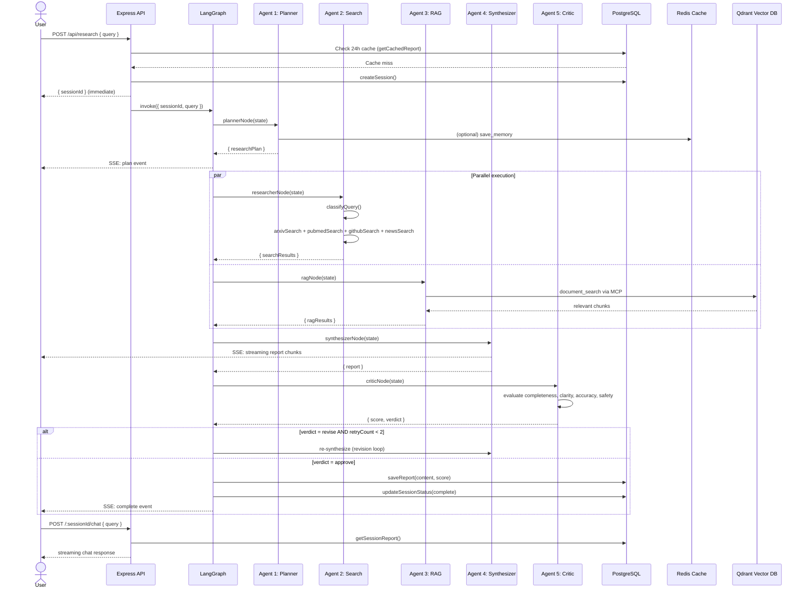

# 🏗️ ResearchFlow Architecture & System Diagrams

This document outlines the detailed interaction sequences, query routing mechanisms, ingestion pipelines, and authentication flows that power the **ResearchFlow** engine.

---

## 🔄 1. Detailed Interaction Flow (Sequence Diagram)

This sequence diagram illustrates the lifecycle of a research query, from the user's initial POST request, through the LangGraph agent orchestration, parallel worker swarms, streaming synthesis, and the iterative Critic validation loop.

---

## 🤖 2. Agent Pipeline

Below is the execution flow of the LangGraph state machine orchestrating the specialized research agents:

  

---

## 🧭 3. Query Routing

The routing classifier determines which external web search tools, academic databases, and social forums are activated based on semantic keywords in the query:

  

---

## 📥 4. Document Ingestion Pipeline

How uploaded documents (PDFs, URLs, YouTube videos) are parsed, chunked, embedded, and indexed into Postgres metadata and Qdrant Vector DB collections:

  

---

## 🔐 5. Authentication Flow

The secure user session lifecycle managed via JWT, Node-Postgres database records, and Redis OTP verification:

  

